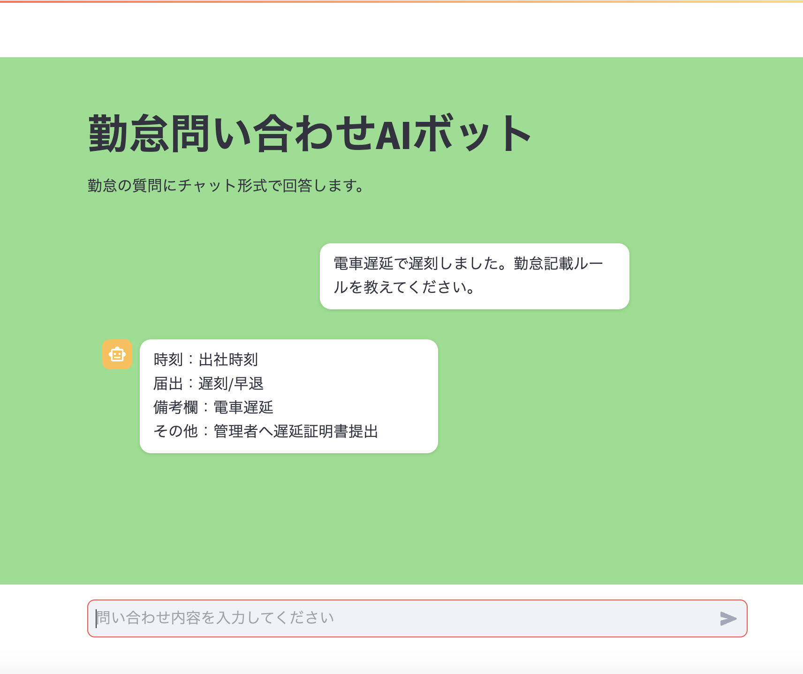

# 勤怠問い合わせAIボット
## 画面イメージ


社内の勤怠問い合わせを受け付ける、Python製のチャットボットです。  
入力内容を分類し、**ルール確認**の場合は `rules.txt` を参照して回答、  
**勤怠ミス報告 / その他** の場合は管理者確認向けテンプレを返します。

---

## 1. 概要

このプロジェクトは、勤怠に関する問い合わせ対応をシンプルに補助するためのアプリです。

- 問い合わせを自動で分類
- ルール確認は `rules.txt` ベースで回答（擬似AI）
- ミス報告系は確認テンプレを提示
- StreamlitでチャットUIを提供

---

## 2. 主な機能

- 問い合わせ種別判定（`ルール確認 / 勤怠ミス報告 / その他`）
- カテゴリ判定（`記載ミス / 打刻漏れ / 遅刻 / 電車遅延 / 午前休/午後休 / 休日出勤 / その他`）
- チャットUI（Streamlit）
- 勤怠ミス時のテンプレ表示
- `rules.txt` を参照した擬似AI回答

---

## 3. 使用技術

- Python
- Streamlit

---

## 4. セットアップ方法

### 前提

- Python 3.10 以上（推奨）
- `pip` が利用できること

### 手順

```bash
git clone <your-repository-url>
cd attendance-ai-bot
pip install -r requirements.txt
```

> `rules.txt` はアプリと同じディレクトリに配置してください。

---

## 5. 実行方法

### Streamlit（推奨）

```bash
streamlit run app.py
```

ブラウザでチャット画面が開きます。

### CLI版（確認用）

```bash
python main.py
```

---

## 6. 今後の拡張予定

- LLM API（OpenAI等）への切り替え対応
- カテゴリ判定の精度向上（同義語・文脈対応）
- 会話履歴の保存（DB連携）
- 管理者向け通知連携（Slack / メールなど）
- テストコード整備（ユニットテスト）

---

## 7. ディレクトリ構成

```text
attendance-ai-bot/
├── app.py           # StreamlitチャットUI
├── main.py          # 判定ロジック・回答生成・CLI実行
├── rules.txt        # 擬似AI回答で参照する勤怠ルール
├── requirements.txt # 依存パッケージ
└── README.md
```

---

## 補足

- 本プロジェクトの「AI回答」は現時点では **`rules.txt` の参照ベース**です。
- 画面には最終返信のみ表示し、内部の判定結果（種別・カテゴリ）はUI上に直接表示しない構成にしています。