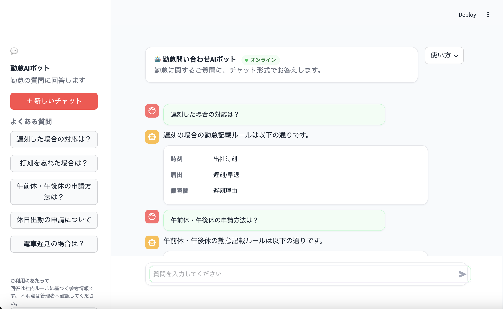

# 勤怠問い合わせAIボット

社内で発生する勤怠に関する問い合わせ対応を効率化するために開発した、LLMを活用したチャットボットです。

社員からの問い合わせ内容を判定し、社内ルールに関する質問については関連するルール情報を取得したうえで、OpenAI APIを利用して自然な回答を生成します。

一方、打刻漏れなど個別対応が必要な問い合わせについては、AIが判断するのではなく管理者への確認を案内する設計としています。

---

## 1. 背景

管理業務では、以下のような勤怠に関する問い合わせが日常的に発生します。

- 遅刻時の対応
- 電車遅延時の対応
- 打刻漏れ
- 勤怠の記載ミス
- 午前休・午後休の取得方法
- 休日出勤の申請方法

同じような問い合わせへの対応が繰り返し発生することから、社内ルールに基づいて一次回答を行う仕組みとして本ツールを開発しました。

---

## 2. 画面イメージ



---

## 3. 主な機能

- Streamlitを利用したチャット形式のUI
- 問い合わせ種別の自動判定
- 問い合わせ内容のカテゴリ判定
- `rules.txt` から関連する社内ルールを取得
- OpenAI APIを利用したLLM回答生成
- ルールに存在しない内容に対する管理者確認への誘導
- 勤怠ミスなど個別対応が必要な問い合わせへのテンプレート表示
- セッション中のチャット履歴保持

---

## 4. システム構成

```text
ユーザー
   │
   ▼
Streamlit UI
   │
   ▼
問い合わせ種別判定
   │
   ├── 勤怠ミス・個別対応
   │        │
   │        ▼
   │   管理者確認テンプレート
   │
   └── ルール確認
            │
            ▼
       カテゴリ判定
            │
            ▼
       rules.txt
            │
            ▼
     関連ルールのみ取得
            │
            ▼
       OpenAI API
            │
            ▼
         LLM回答
```

LLMには `rules.txt` 全体を毎回送信せず、問い合わせのカテゴリに対応するルールのみを渡すことで、不要なトークン消費を抑えています。

---

## 5. ディレクトリ構成

```text
attendance-ai-bot/
├── app.py
├── main.py
├── llm.py
├── rules.txt
├── requirements.txt
├── .gitignore
├── .cursorignore
├── images/
│   └── chat-ui.png
└── README.md
```

`.env` にはOpenAI APIキーを保存しますが、秘密情報のためGitの管理対象外としています。

---

## 6. 使用技術

- Python
- Streamlit
- OpenAI API
- python-dotenv
- Git
- GitHub

---

## 7. セットアップ

### 1. リポジトリを取得

```bash
git clone <repository-url>
cd attendance-ai-bot
```

### 2. 必要なライブラリをインストール

```bash
pip install -r requirements.txt
```

### 3. OpenAI APIキーを設定

プロジェクト直下に `.env` を作成します。

```text
OPENAI_API_KEY=your_api_key_here
```

> `.env` はGitHubへアップロードしないでください。

### 4. アプリを起動

```bash
streamlit run app.py
```

---

## 8. LLM回答の仕組み

社内ルールに関する問い合わせでは、以下の流れで回答を生成します。

```text
ユーザーの質問
      │
      ▼
問い合わせ判定
      │
      ▼
カテゴリ判定
      │
      ▼
rules.txtから関連ルールを取得
      │
      ▼
質問 + 関連ルールをLLMへ送信
      │
      ▼
ルールに基づいた回答を生成
```

LLMに自由に回答させるのではなく、取得した社内ルールを回答の根拠として渡します。

ルールから判断できない内容については推測による回答を避け、管理者への確認を案内する方針としています。

---

## 9. API利用量を抑える工夫

OpenAI APIの利用量を抑えるため、以下の設計としています。

- `rules.txt` 全体を毎回LLMへ送信しない
- 問い合わせカテゴリに関連するルールのみ送信
- LLMが必要な問い合わせでのみAPIを呼び出す
- 1回の質問につき原則1回だけAPIを呼び出す
- 過去のチャット履歴をLLMへ送信しない
- 回答の最大出力量を制限

---

## 10. 工夫した点

### AIにすべてを判断させない

社内ルールの確認と、個別対応が必要な問い合わせを分離しています。

例えば、ルールの説明はLLMが担当しますが、打刻漏れなど管理者による個別確認が必要なケースでは、LLMによる判断ではなく管理者確認へ誘導します。

### LLM処理を分離

LLM回答処理を `llm.py` に分離し、既存の問い合わせ判定ロジックと切り離しています。

これにより、LLMモデルの変更や将来的なデータソース変更に対応しやすい構成を意識しています。

### 将来のデータソース変更を想定

現在は `rules.txt` を社内ルールのデータソースとして使用しています。

将来的には、ConfluenceやBoxなどに保存されている社内ドキュメントから必要な情報を取得し、LLMへ渡す構成への拡張を想定しています。

---

## 11. 今後の展望

今後は以下の機能追加・改善を検討しています。

- Confluenceとの連携
- Boxとの連携
- Excel・PDFなど複数形式の社内ドキュメントへの対応
- RAGを利用した関連情報検索
- 問い合わせログの保存・分析
- 回答精度を評価するテスト機能
- 管理者へのエスカレーション機能
- 対応可能な社内問い合わせカテゴリの拡大

勤怠問い合わせだけでなく、将来的にはさまざまな社内ルールの問い合わせに対応できる社内AIアシスタントへの発展を目指しています。

---

## 12. ライセンス

個人学習・ポートフォリオ用途として作成しています。